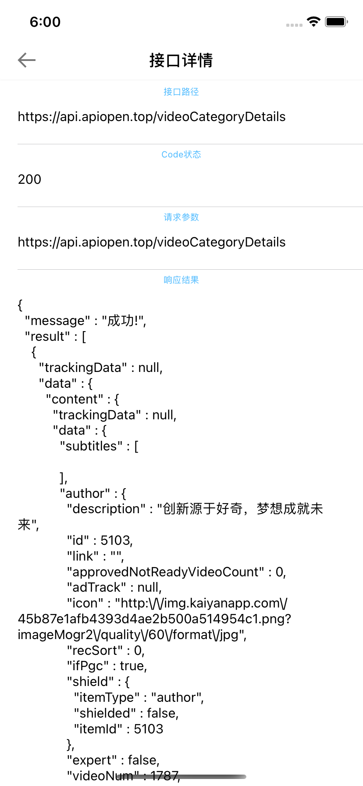

# iOS 应用内抓包Demo

### 1、背景

	平时开发及使用经常会遇到需要抓接口的情形，一般的做法是将手机代理到电脑，再通过Charles软件进行抓包。然而这种方法是有一定的
	局限性的，如果身边没有电脑就没办法操作，而且用电脑上Charles抓包过程也相对繁琐，连接网络配置端口，https请求还需要安装信任
	证书。为了使任何安装了我们应用的设备在出现任何接口异常或者接口数据需要考证的时候，能当即抓取接口验证，就有了应用内抓包的功能
	模块的研究及开发。

###    2、Demo演示

打开开关

接口列表

接口详情

